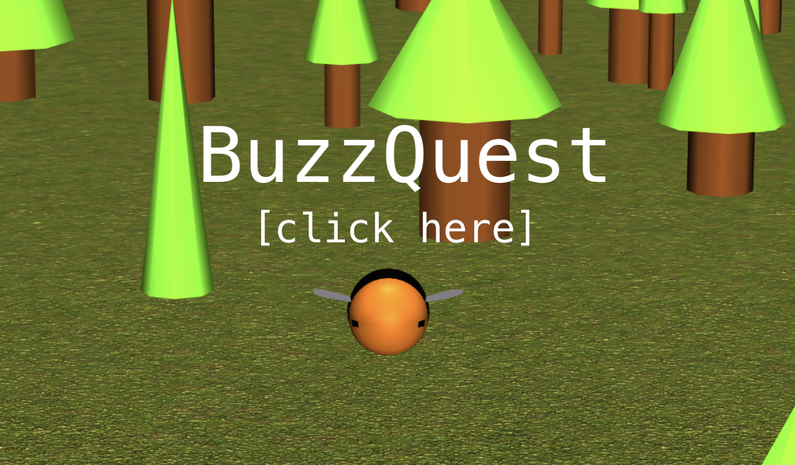
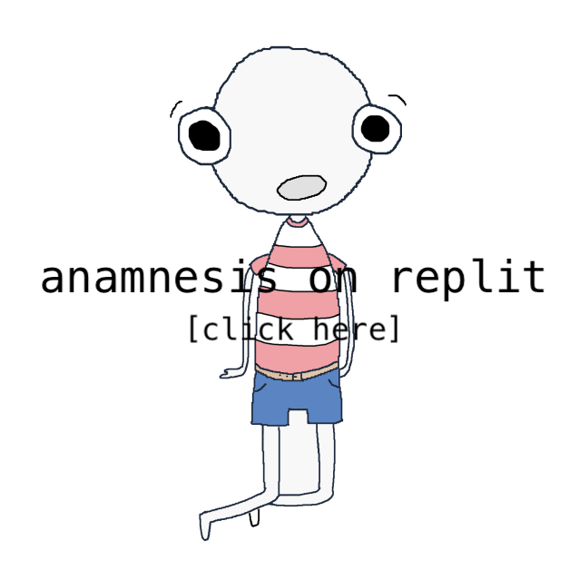
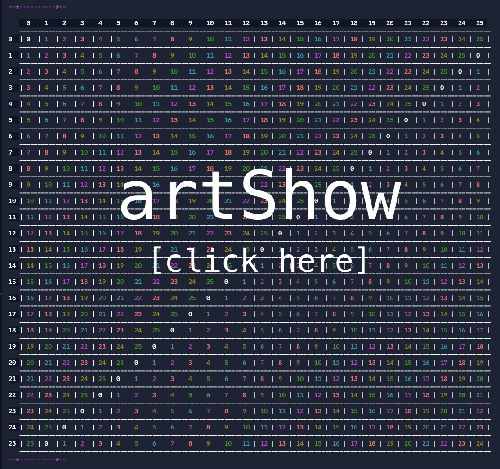
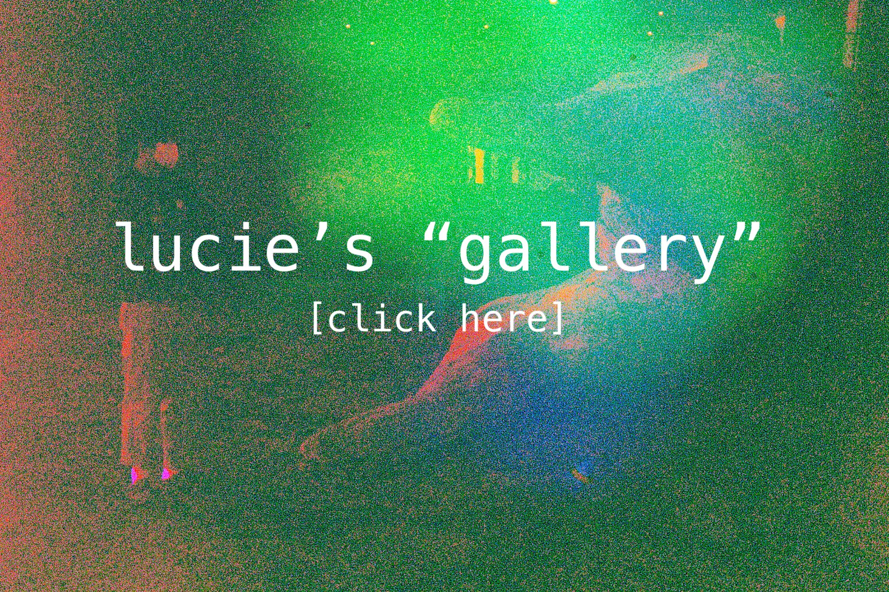

# About

Lucie Brock (they/them) is a data engineer at MITRE in the Data Environments & Engineering department, currently working on the BioMADE project. They are interested in ethics of AI and ethical computing practice. Outside of work, they entertain themself by making music, sewing cat toys, making mining machines in minecraft, and they have a general passion for collecting gadgets and gizmos.

### Education
Smith College - 2024 - B.A. in CS & Philosophy

University of Oxford, Lady Margaret Hall - Visiting Student Program

Northfield Mount Hermon - 2020

# Little Projects

This is a game (generously put) made using JavaScript, HTML, and Blender. For instructions on how to use it, see the readme. Check it out!

This game was made in collaboration with 2 classmates. It is a robust text-based adventure game titled Anamnesis, made in Java (with the guava package). The project includes around 5,000 words of flavor text, and a compelling plot line. Try it out!

This is a "calculator" (of sorts) made with a classmate (and dear friend) that produces ~pretty math art~ using modulo addition/multiplicaiton tables, does the euclidean/reverse euclidean formula, has a binary search visualization, and a few other random methods. Have a look!

# "Art"

