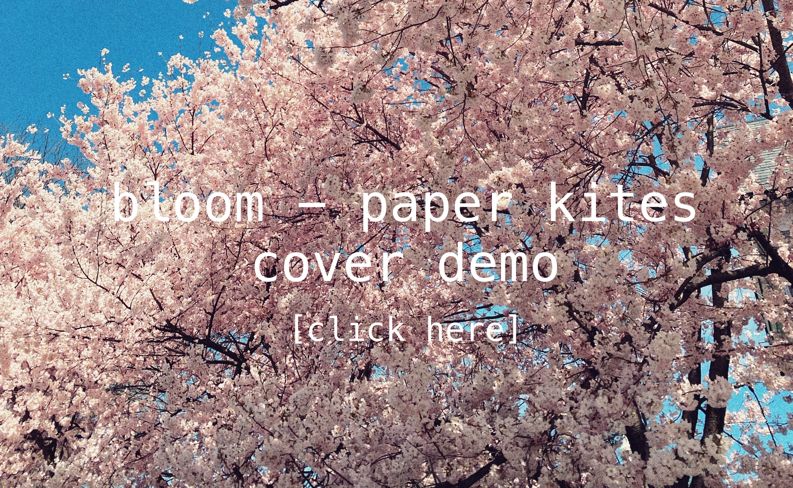

# about lucie

lucie brock (they/them) is a smith college student in the class of 2024, with a double major in cs & philosophy. 
they are interested in ethics, software development, engineering, and data vis. this past summer, they worked in virginia as a transportation safety  engineering intern at MITRE. and, this spring they head off to oxford as a visiting student to further their studies in computer science and philosophy.
outside of academia, lucie is a member of the smith college vibes a capella group, plays guitar, enjoys minecraft, and has a passion for collecting random gadgets and gizmos (always looking for a project). 

# projects

worked on a team of 5 to produce a bikesharing app for the final project in introduction to software engineering. using ruby on rails, HTML, CSS, JavaScript, and a lot of redbull, our team produced a sleek and straightforward minimum viable product. **our team won the 2022 Demo Day** for our course, in which all 6 teams in the class presented their bike sharing app (under the name ValetBike), and competed for the best MVP. 

[check out the repository!](https://github.com/epartakki/valetbike)

collaborated with a team of 2 students to produce a robust text-based adventure game titled anamnesis in java (with the guava package). the project **recieved a 30/30 (100%) score** as a final project in introduction to data structures, a highly competitive and challenging course. includes around 5,000 words of flavor text, and a compelling plot line. try it out!

produced a "calculator" (of sorts) with a classmate (and dear friend) that produces some ~pretty math art~ using modulo addition/multiplicaiton tables, does the euclidean/reverse euclidean formula, has a binary search visualization, and a few other random methods. this project was presented for the end of year art show in discrete mathemtatics. have a look!

# "art"

## contact
email: lmbrock@smith.edu

discord: chapstickwearer#0207
